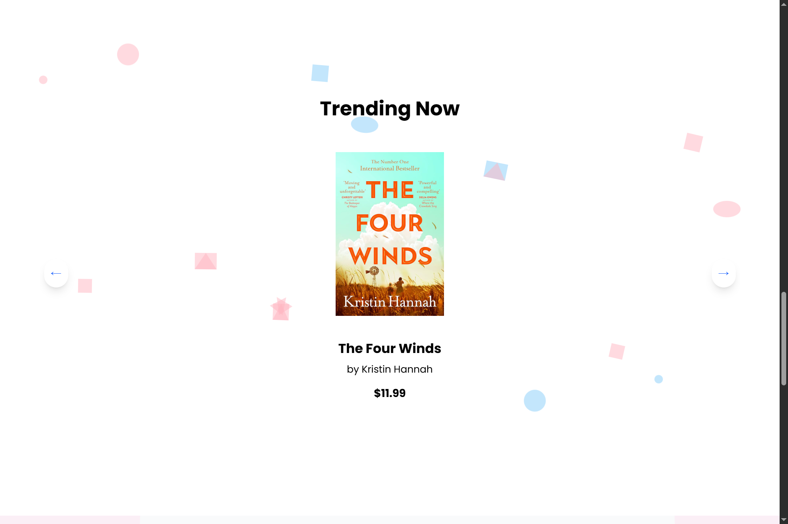
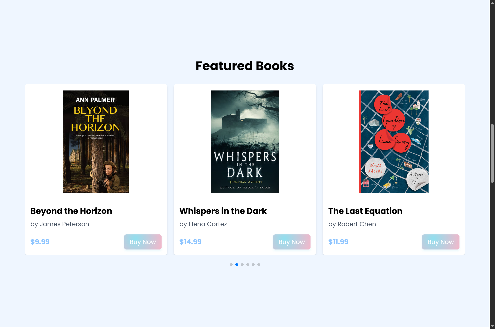

# 📚 BookHaven - Modern E-Book Store

<div align="center">
  
  
  
  
</div>

## 📖 Project Overview

BookHaven is a modern e-commerce platform designed for digital book enthusiasts. This project showcases a sleek, responsive interface with optimized user experience across all devices.

## 📸 Screenshots

<div align="center">
  
  
  
</div>

## 🏆 Bestsellers Carousel Component

Our featured component provides an elegant browsing experience for discovering top-selling e-books.

### ✨ Key Features

- **Responsive Design**: Seamlessly transforms between mobile carousel and desktop grid layouts
- **Intuitive Navigation**: User-friendly controls with previous/next buttons and pagination indicators
- **Visual Elegance**: Carefully crafted with decorative elements and subtle shadows
- **Performance Optimized**: Engineered for efficiency using React hooks and modern rendering techniques

### 🛠️ Technology Stack

```javascript
// Core dependencies
{
  "react": "^18.2.0",
  "tailwindcss": "^3.3.0",
  "lucide-react": "^0.264.0"  // For navigation icons
}
```

### 📱 Responsive Implementation

| Device | Display Layout | Items Visible | Navigation Methods |
|--------|---------------|---------------|-------------------|
| Mobile | Horizontal Carousel | 1 | Touch swipe + directional buttons |
| Tablet | Horizontal Carousel | 2 | Touch swipe + directional buttons |
| Desktop | Grid Display | 4 | Pagination controls + directional buttons |


## 🚀 Getting Started


### Component Usage

```jsx
import BestsellersCarousel from './components/BestsellersCarousel';

function App() {
  return (
    <div className="container mx-auto px-4 py-8">
      <h2 className="text-2xl font-bold mb-6">Bestselling E-Books</h2>
      <BestsellersCarousel />
    </div>
  );
}
```

### Customization Options

```jsx
// Custom configuration example
<BestsellersCarousel 
  booksPerPage={3}                   // Override default items per view
  autoplay={true}                    // Enable automatic scrolling
  autoplaySpeed={5000}               // Set interval in milliseconds
  theme="blue"                       // Alternative color theme
/>
```


## 🌐 Deployment

### Build for Production
```bash
npm run build
```

### Recommended Hosting Platforms
- Vercel
- Netlify
- AWS Amplify


## 🤝 Contributing

Contributions are welcome! Please feel free to submit a Pull Request.


---

<div align="center">
  Made with ❤️ using React and Tailwind CSS
</div>
